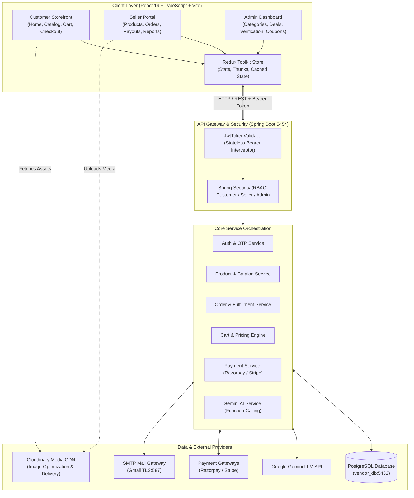
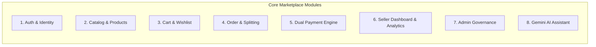
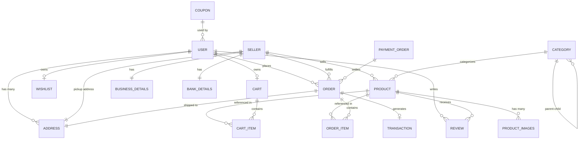

# Multi-Vendor E-Commerce Platform with AI Conversational Commerce
### Enterprise Multi-Merchant Marketplace

[](https://www.oracle.com/java/)
[](https://spring.io/projects/spring-boot)
[](https://react.dev/)
[](https://www.typescriptlang.org/)
[](https://vitejs.dev/)
[](https://www.postgresql.org/)
[](https://ai.google.dev/)
[](https://razorpay.com/)
[](https://stripe.com/)

---

# PROJECT SYNOPSIS
## Next-Generation Multi-Vendor E-Commerce Platform with AI-Driven Conversational Commerce

---

### **Document Information**
- **Project Title:** Multi-Vendor E-Commerce & Marketplace Application
- **Author/Developer:** Vikas Prajapati
- **Document Type:** Comprehensive Technical Project Synopsis & Architecture Document
- **Architecture Style:** Decoupled Client-Server (RESTful Web Services & Single Page Application)
- **Version:** 1.0.0

---

## 1. Executive Summary & Abstract

The **Multi-Vendor E-Commerce Platform** is an enterprise-grade digital marketplace designed to bridge independent merchants (sellers) and consumers (buyers) within a unified, high-performance ecosystem. Built upon a modern, resilient technology stack featuring **Spring Boot (Java 21)** on the backend and **React 19 with TypeScript and Vite** on the frontend, the platform facilitates end-to-end e-commerce operations—from multi-tier catalog browsing and dynamic cart calculations to secure multi-gateway transactions and merchant payouts.

Distinguishing features of the platform include:
1. **Multi-Vendor Order Splitting:** An automated orchestration mechanism where a customer's unified shopping cart containing items from multiple distinct vendors is atomically broken down into discrete sub-orders per vendor upon checkout.
2. **Dual Payment Gateway Integration:** Seamless support for both domestic and international transactions using **Razorpay** and **Stripe**, complete with automated payment order tracking.
3. **AI-Powered Conversational Assistant:** Integration of **Google Gemini Large Language Model (LLM)** equipped with **Function Calling capabilities**, allowing users to query cart contents, order delivery history, and live product specifications through natural language.
4. **Role-Based Access Control (RBAC):** Granular authorization isolating Customers, Sellers, and Platform Administrators using stateless **JSON Web Tokens (JWT)** and Spring Security.

---

## 2. Problem Statement & Motivation

Traditional single-seller e-commerce websites exhibit significant structural limitations:
- **Scalability & Catalog Diversity:** Single-merchant systems struggle to scale product variety and geographic reach without enormous warehousing overhead.
- **Merchant Inclusion:** Local artisans, textile producers, and small retailers lack affordable, scalable technological platforms to showcase their goods alongside established brands.
- **Order Complexity:** Handling carts with products from diverse physical locations requires sophisticated logistics splitting, localized inventory tracking, and split-commission payout calculations.
- **Customer Engagement Bottlenecks:** Traditional search-and-filter interfaces can overwhelm users. Without intelligent conversational guidance, finding nuanced products (e.g., specific regional Indian ethnic weaves like Kanjeevaram, Banarasi, or Paithani sarees) results in abandoned shopping sessions.

This project addresses these challenges by delivering an open multi-vendor marketplace with self-service vendor onboarding, automated financial tracking, role-segmented management dashboards, and an integrated AI shopping assistant.

---

## 3. Project Objectives

- **Democratize Vendor Onboarding:** Enable independent merchants to register, configure business credentials (GSTIN, bank details), and list catalog items with customized pricing, sizing, and media galleries.
- **Deliver Unified Customer Experience:** Provide customers with smooth category navigation across 3-tier deep taxonomies, real-time inventory checks, instant coupon application, and multi-address management.
- **Ensure Financial Integrity & Security:** Implement atomic transactions, tamper-proof payment verification, and encrypted credentials using industry-standard cryptography.
- **Incorporate Artificial Intelligence:** Leverage Gemini Generative AI to transition from passive product searching to proactive, contextual conversational commerce.
- **Maintain Modular, Maintainable Code:** Adopt Domain-Driven Design principles, reactive state management (Redux Toolkit), and clean REST API contracts.

---

## 4. System Architecture & High-Level Design

The system adheres to a **Decoupled 3-Tier Layered Architecture**:
1. **Presentation Layer (Client):** Single Page Application (SPA) powered by React 19, TypeScript, Material-UI (MUI), and Tailwind CSS, managed by Redux Toolkit.
2. **Application & Business Logic Layer (Server):** Stateless Spring Boot 3/4 REST API microservice architecture utilizing Spring Security, Spring Data JPA, and Spring Mail.
3. **Data Layer (Storage & External Services):** PostgreSQL relational database, Cloudinary CDN for optimized media delivery, and external Payment & AI APIs.

### Architecture Diagram



---

## 5. Key Stakeholders & System Roles

| Role | Target Entity | Core Responsibilities & Privileges |
| :--- | :--- | :--- |
| **ROLE_CUSTOMER** | Shopper / End-User | - Browse, search, filter catalog by categories, colors, discounts, and prices.<br>- Manage cart, apply promotional coupons, save wishlist items.<br>- Add/edit multiple shipping addresses.<br>- Execute checkout via Razorpay or Stripe.<br>- Track order status and post reviews/ratings.<br>- Converse with the Gemini AI assistant. |
| **ROLE_SELLER** | Merchant / Vendor | - Complete multi-step onboarding (Business details, GSTIN, Bank details).<br>- Create, update, and manage product inventory (variants, sizes, prices).<br>- View orders containing their products and update fulfillment lifecycle.<br>- Access revenue metrics, sales reports, and payout histories via Recharts. |
| **ROLE_ADMIN** | Platform Master | - Verify and approve/suspend seller accounts.<br>- Manage multi-level categories (Level 1, Level 2, Level 3).<br>- Curate homepage deal grids, promotional banners, and category showcases.<br>- Generate, activate, and revoke marketplace discount coupons. |

---

## 6. Functional Modules & Subsystems



### 6.1. Authentication, Authorization & Identity Management
- **Stateless JWT Security:** Generates short-lived access tokens and refresh tokens upon authentication.
- **Two-Factor OTP Verification:** Secure email verification using Spring Mail over SMTP TLS for user login, seller registration, and password resets.
- **Role Isolation:** Strict URI security rules ensuring sellers cannot manipulate admin settings and customers cannot access vendor reports.

### 6.2. Multi-Level Category & Product Catalog Subsystem
- **Hierarchical Taxonomy:** 3-tier deep categories:
  - *Level 1:* Main Department (e.g., `women`, `men`, `home_furniture`, `electronics`)
  - *Level 2:* Product Line (e.g., `women_clothing`, `footwear`)
  - *Level 3:* Specific Category (e.g., `women_sarees`, `women_kurtas`, `lehenga_choli`)
- **Dynamic Product Filtering:** Backend JPA Specification filtering by category slug, color palette, price brackets, discount percentages, and stock availability.
- **Media Management:** Direct-to-Cloudinary image uploading ensuring responsive WebP delivery without overloading backend file systems.

### 6.3. Cart, Pricing & Wishlist Engine
- **Atomic Pricing Calculation:** Real-time summation of Total MRP, Item Discounts, Selling Prices, Coupon Deductions, and Net Payable amounts.
- **Coupon Validation Logic:** Checks coupon validity dates, active status, minimum order threshold, and user applicability before applying discounts.
- **Wishlist Management:** Persistent user wishlist supporting instant one-click transfer of saved products to the active cart.

### 6.4. Multi-Vendor Order Splitting & Fulfillment
- **Automated Order Decomposition:** When a customer orders 5 items originating from 3 different sellers, the backend creates:
  - A primary **PaymentOrder** consolidating the total monetary amount.
  - 3 separate **Order** records, each assigned to the respective `sellerId`.
- **Fulfillment State Machine:** Independent state tracking per seller:
  $$\text{PENDING} \longrightarrow \text{PLACED} \longrightarrow \text{CONFIRMED} \longrightarrow \text{SHIPPED} \longrightarrow \text{DELIVERED} \quad (\text{or } \text{CANCELLED})$$

### 6.5. Dual Payment Gateway Integration
- **Razorpay Integration:** Creates Razorpay Order instances with exact amounts and receipt IDs, launching the native client checkout modal.
- **Stripe Checkout:** Generates hosted Stripe Checkout sessions supporting international credit/debit cards with success and cancellation redirection URLs.
- **Transaction Ledger:** Records every successful debit/credit transaction linked to orders, sellers, and customers for audit compliance.

### 6.6. Seller Analytics & Management Dashboard
- **Real-Time KPI Cards:** Displays total revenue, pending orders, completed deliveries, and cancellation rates.
- **Visual Analytics:** Interactive sales trends and performance visualization powered by **Recharts**.
- **Inventory Tracking:** Low-stock warnings and stock quantity management.

### 6.7. AI Conversational Commerce (Google Gemini LLM)
- **Function Calling Engine:** The backend registers structured JSON function declarations with the Gemini API:
  - `getUserCart`: Fetches real-time shopping cart contents.
  - `getUsersOrder`: Retrieves user order history, statuses, and delivery dates.
  - `getProductDetails`: Extracts deep product specifications, materials, and prices.
- **Intelligent Response Generation:** Translates technical database outputs into empathetic, concise, and helpful conversational responses to shoppers.

---

## 7. Database Architecture & Entity Relationship (ER) Schema

The database is deployed on **PostgreSQL (vendor_db)** and managed via **Hibernate ORM**.



### Key Relational Tables:
1. **`users`**: Customer credentials, roles, profile image, mobile.
2. **`seller`**: Merchant profile, account verification status, GSTIN.
3. **`product`**: Product catalog attributes, MRP, selling price, quantity, color, category link.
4. **`product_images`**: Multi-image URLs associated with each product.
5. **`category`**: 3-level tree hierarchy with self-referential foreign keys.
6. **`cart` & `cart_item`**: Temporary shopping session data with dynamic discount rules.
7. **`orders` & `order_item`**: Persistent order records separated per seller.
8. **`payment_order`**: Master payment gateway tracking record.
9. **`coupon`**: Promotional discount rules and validity constraints.
10. **`review`**: Customer ratings (1-5 stars), text feedback, and reviewer media.

---

## 8. Technology Stack & Implementation Details

| Layer / Aspect | Technology | Version | Justification / Role |
| :--- | :--- | :--- | :--- |
| **Backend Framework** | **Spring Boot** | 3.x / 4.1.0 | Industry-standard Java enterprise framework providing DI, auto-configuration, and robust REST APIs. |
| **Language** | **Java** | **JDK 21** | Modern LTS release offering virtual threads, pattern matching, and superior performance. |
| **ORM & Persistence** | **Spring Data JPA / Hibernate** | Latest | Simplifies complex CRUD operations, entity relationships, and transactional queries. |
| **Database** | **PostgreSQL** | **17.x** | Enterprise ACID-compliant relational database capable of handling complex multi-table joins. |
| **Security & Auth** | **Spring Security + JJWT** | 0.11.1 | Stateless token-based security filter chain with BCrypt password hashing. |
| **Frontend Framework** | **React** | **19.1.0** | Declarative component architecture delivering fluid, responsive user interfaces. |
| **Language (Client)** | **TypeScript** | **5.8.x** | Strong static typing to prevent runtime bugs across complex e-commerce state models. |
| **Build Tool** | **Vite** | **7.0.x** | Ultra-fast build tool and Hot Module Replacement (HMR) for superior developer experience. |
| **State Management** | **Redux Toolkit** | **2.8.2** | Centralized, predictable application state for cart, authentication, and seller data. |
| **UI Component Library**| **Material-UI (MUI)** | **7.1.x** | Polished, accessible e-commerce and administrative dashboard components. |
| **Styling** | **Tailwind CSS** | **3.4.x / 4.x** | Utility-first responsive styling framework for custom storefront layouts. |
| **Payments** | **Razorpay & Stripe SDKs** | 1.4.9 / 26.12 | Comprehensive payment processing covering UPI, Net Banking, Cards, and International Currencies. |
| **Artificial Intelligence**| **Google Gemini API** | REST / v1beta | Generative conversational intelligence with native function calling for live platform querying. |
| **Media Hosting** | **Cloudinary CDN** | API v1_1 | Automatic image optimization, WebP compression, and responsive content delivery. |

---

## 9. Security, Quality & Performance Considerations

- **Stateless Authorization:** The server never stores user sessions in memory; authentication relies strictly on encrypted, signed JWT tokens passed via HTTP `Authorization: Bearer <token>` headers.
- **SQL Injection & XSS Prevention:** Handled via Hibernate parameterized queries and React’s built-in JSX contextual escaping.
- **Password Protection:** Sensitive credentials stored as cryptographically salted hashes using **BCryptPasswordEncoder**.
- **Transactional Consistency:** Critical multi-table updates (such as Order Splitting, Inventory Decrement, and Cart Clearing) are wrapped in `@Transactional` blocks to prevent partial writes.
- **Asset Optimization:** Storefront media assets are served through Cloudinary CDN with automatic format selection (`webp`) and responsive image sizing to maximize Google PageSpeed scores.

---

## 10. System Prerequisites & Hardware Specifications

### Minimum Development Hardware:
- **Processor:** Dual-Core 64-bit Intel Core i5 / AMD Ryzen 5 or equivalent.
- **Memory (RAM):** 8 GB minimum (16 GB recommended for concurrent Spring Boot + Vite + PostgreSQL instances).
- **Disk Space:** 5 GB free disk space.

### Software Requirements:
- **Operating System:** Windows 10/11, macOS, or Ubuntu Linux 20.04+.
- **Java Development Kit:** JDK 21 installed (`JAVA_HOME` configured).
- **Node.js Environment:** Node.js v18+ and npm v9+.
- **Database Engine:** PostgreSQL 15+ running on port 5432.
- **Build Tools:** Apache Maven 3.9+ and Vite 7+.

---

## 11. Future Scope & Enhancement Roadmap

1. **Microservices Decomposition:** Decompose monolithic Spring Boot application into distinct containerized microservices (Auth Service, Catalog Service, Order Service, Notification Service) managed via Docker and Kubernetes.
2. **Real-Time Websocket Notifications:** Implement Spring WebSocket (STOMP) to push instant notifications to sellers when new orders are placed and to customers during shipment transit.
3. **Advanced Seller Payout Automation:** Integrate Stripe Connect or Razorpay Route for automated, direct split transfers of net vendor earnings post-commission.
4. **Visual Product Search:** Enhance Gemini AI integration with multimodal image search allowing shoppers to upload photos of outfits and discover visually similar products across the catalog.
5. **Progressive Web App (PWA) & Mobile Native Apps:** Package frontend as an offline-capable PWA and build cross-platform mobile apps using React Native.

---

## 12. Conclusion

The **Multi-Vendor E-Commerce Platform** represents a comprehensive, modern solution to the complexities of multi-merchant digital commerce. By harmonizing robust backend architecture in Spring Boot with reactive, component-driven frontend interfaces in React 19, the system achieves exceptional responsiveness, security, and maintainability. Its unique integration of automated order splitting, dual domestic/international payment processing, and Google Gemini AI conversational commerce establishes it as a highly capable, future-ready commercial platform.


## 📡 REST API Endpoints Specification

| Module | Method | Endpoint | Access Role | Description |
| :--- | :--- | :--- | :--- | :--- |
| **Auth** | `POST` | `/auth/signup` | Public | Register new customer account |
| **Auth** | `POST` | `/auth/signin` | Public | Authenticate user & return JWT token |
| **Auth** | `POST` | `/auth/sent/login-signup-otp` | Public | Generate and send email OTP |
| **Products** | `GET` | `/products` | Public | Query paginated & filtered products |
| **Products** | `GET` | `/products/{productId}` | Public | Retrieve product detail by ID |
| **Cart** | `GET` | `/api/cart` | Customer | Fetch current user's cart |
| **Cart** | `PUT` | `/api/cart/add` | Customer | Add item variant to cart |
| **Orders** | `POST` | `/api/orders` | Customer | Checkout & trigger multi-vendor order split |
| **Orders** | `GET` | `/api/orders/user` | Customer | Fetch current customer order history |
| **Payments** | `POST` | `/api/payment/{paymentMethod}/order/{orderId}` | Customer | Initiate Razorpay or Stripe checkout link |
| **Seller** | `POST` | `/sellers` | Public | Apply for vendor registration |
| **Seller** | `GET` | `/api/sellers/products` | Seller | List all vendor's catalog items |
| **Seller** | `POST` | `/api/sellers/products` | Seller | Create a new product listing |
| **Seller** | `GET` | `/api/seller/orders` | Seller | View orders assigned to this seller |
| **Seller** | `PATCH` | `/api/seller/orders/{orderId}/status/{status}` | Seller | Update order fulfillment status |
| **Admin** | `GET` | `/api/admin/sellers` | Admin | Review pending merchant accounts |
| **Admin** | `PATCH` | `/api/admin/sellers/{id}/status/{status}` | Admin | Approve or suspend vendor |
| **Admin** | `POST` | `/api/coupons` | Admin | Create new promotional discount coupon |

---

## 🚀 Getting Started & Local Setup

### Prerequisites
- **Java:** JDK 21+ installed (`java -version`)
- **Maven:** Apache Maven 3.9+ (`mvn -version`)
- **Node.js:** v18+ and npm v9+ (`node -v`, `npm -v`)
- **Database:** PostgreSQL 15+ running on port 5432

### Step 1: Database Setup
Create a PostgreSQL database named `vendor_db`:
```sql
CREATE DATABASE vendor_db;
```

### Step 2: Backend Configuration & Execution
1. Navigate to backend:
   ```bash
   cd "Multi Vendor backend"
   ```
2. Configure `src/main/resources/application.properties` (Port 5454, DB credentials, SMTP, Gemini API key).
3. Start Spring Boot:
   ```bash
   mvn clean spring-boot:run
   ```
   *Backend URL:* `http://localhost:5454`

### Step 3: Frontend Configuration & Execution
1. Navigate to frontend:
   ```bash
   cd ../frontend-vite
   ```
2. Install dependencies & run:
   ```bash
   npm install
   npm run dev
   ```
   *Frontend URL:* `http://localhost:3000`

---

## 👨‍💻 Author & Repository
- **Developer:** Vikas Prajapati
- **Repository:** [multivendor_backend](https://github.com/vikas-prajapatii/multivendor_backend)
